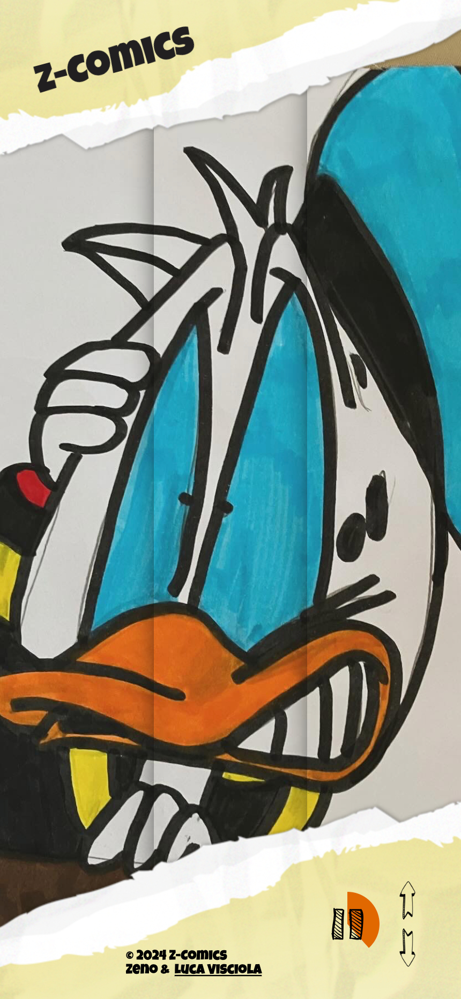
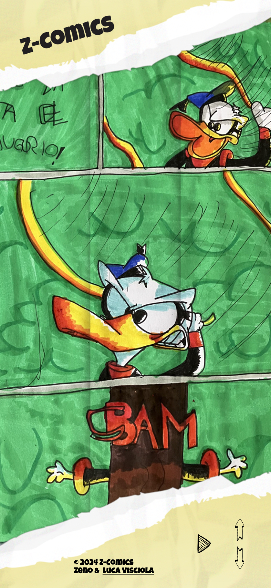
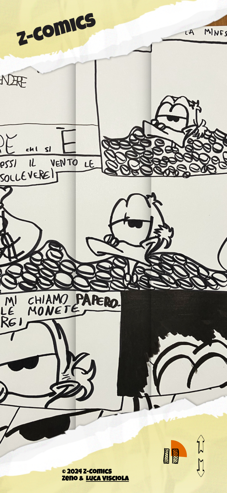
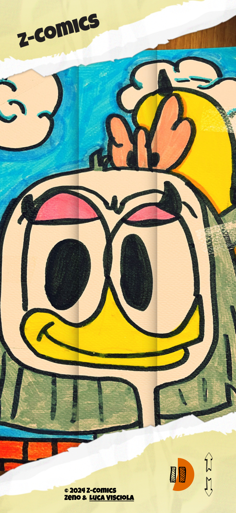

Z-Comics
=============
### Z-Comics: dove l'arte diventa un viaggio quantistico nell'anima.

 [Z-Comics](https://zcomics.it) non è un portale di fumetti: è un universo dove ogni linea e colore tracciano il sentiero verso la scoperta di sé. Qui, le opere d'arte disegnate da Zeno Visciola diventano finestre su realtà parallele, frammenti di un multiverso dove lo spazio-tempo si piega alla creatività e l'infinitamente piccolo si intreccia con l'infinitamente grande. Attraverso il disegno, ci immergiamo in un'esplorazione senza fine, dove ogni tratto rivela nuovi mondi e infinite possibilità. Entrate, e lasciate che la vostra immaginazione si espanda oltre i confini del conosciuto. Qui, l'universo è la vostra tela.

<table style="border:none">
  <tr style="border: none!important;">
    <td style="border: none!important;"></td>
    <td style="border: none!important;"></td>
    <td style="border: none!important;"></td>
    <td style="border: none!important;"></td>
  </tr>
</table>